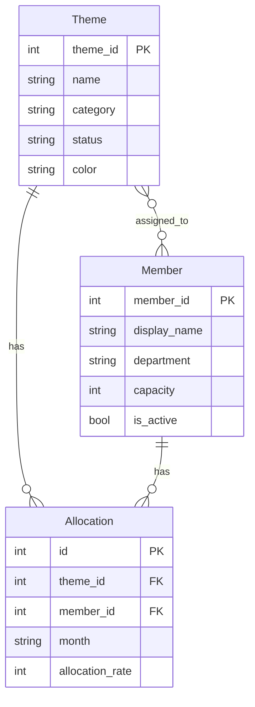

# リソース管理ツール

開発テーマごとの人員配置（誰が・いつ・何割）を可視化し、リソース計画の調整を支援する WEB アプリケーションです。

## 主な機能

- **テーマ視点ガントチャート** — テーマ × メンバー × 月の割当を表形式で可視化
- **メンバー負荷表** — メンバーごとの月次負荷率を集計・表示
- **メンバーアサイン** — テーマへのメンバー追加/解除をワンクリックで操作
- **セル編集 & D&D** — 割当率の直接入力、ドラッグ＆ドロップによる期間移動
- **超過警告** — 月次負荷率が容量を超えた場合の視覚的な警告
- **スケール切替** — 1ヶ月 / 3ヶ月 / 6ヶ月 / 1年の表示粒度
- **テーマ・メンバー管理** — CRUD 操作（カラー・ステータス・容量設定）
- **認証** — Admin / User ロールベースのアクセス制御

## 技術スタック

| レイヤー | 技術 |
|---|---|
| フロントエンド | Vite + Vanilla JS |
| バックエンド | Flask (Python) |
| データベース | SQLite |
| 認証 | Flask-Login |

## セットアップ

### 前提条件

- Python 3.10+
- Node.js 18+

### インストール

```bash
# バックエンド
cd backend
pip install -r requirements.txt

# フロントエンド
cd frontend
npm install
```

### 起動

```bash
# ターミナル1: バックエンド (port 5001)
cd backend
python app.py

# ターミナル2: フロントエンド (port 5173)
cd frontend
npm run dev
```

ブラウザで http://localhost:5173/ を開いてください。

### 初期アカウント

| ユーザー名 | パスワード | 権限 |
|---|---|---|
| `admin` | `admin` | 管理者 |

## プロジェクト構成

```
Manage/
├── backend/
│   ├── app.py                  # Flask アプリ初期化
│   ├── models.py               # SQLAlchemy モデル
│   ├── requirements.txt
│   ├── routes/
│   │   ├── auth.py             # 認証 API
│   │   ├── themes.py           # テーマ CRUD + アサイン API
│   │   ├── members.py          # メンバー CRUD API
│   │   └── allocations.py      # 割当 CRUD + 負荷集計 API
│   └── services/
│       └── allocation_service.py   # 負荷計算・警告判定
├── frontend/
│   ├── index.html              # SPA エントリ
│   ├── vite.config.js
│   ├── css/
│   │   ├── index.css           # デザインシステム
│   │   ├── gantt.css           # ガントチャート
│   │   └── member-view.css     # メンバー負荷表
│   └── js/
│       ├── app.js              # ルーティング・認証
│       ├── api.js              # REST クライアント
│       ├── gantt/
│       │   ├── gantt-renderer.js   # ガント描画
│       │   ├── gantt-editor.js     # セル編集
│       │   └── gantt-dnd.js        # ドラッグ＆ドロップ
│       ├── member/
│       │   └── member-view.js      # メンバー負荷表示
│       └── utils/
│           └── date-utils.js       # 日付ユーティリティ
└── doc/
    └── UserManual.md           # ユーザーマニュアル
```

## データモデル



## ドキュメント

- [ユーザーマニュアル](doc/UserManual.md) — 操作方法の詳細
- [要件定義書](Requirement.md) — 元の要件仕様

## ライセンス

Private
