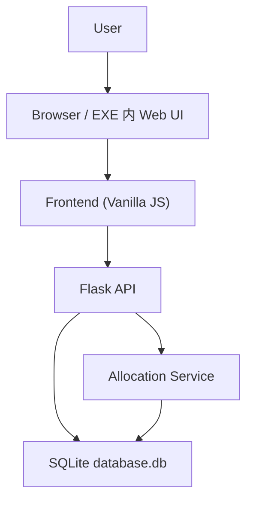
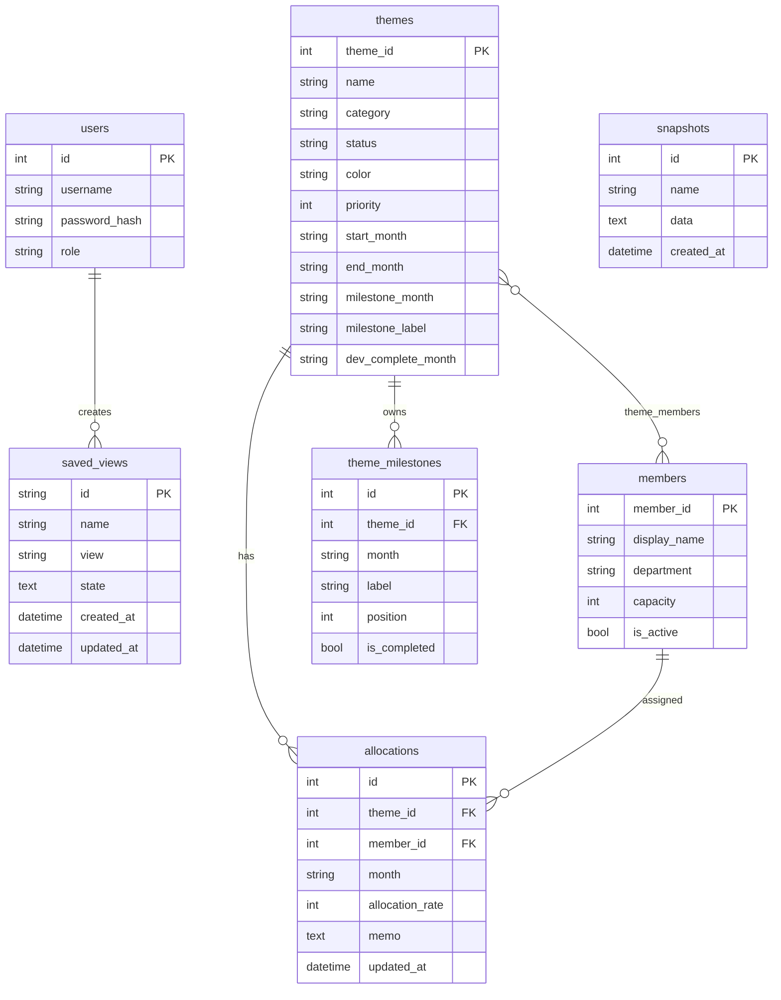

<!--
  Copyright (c) 2026 Masaki Nakai (https://github.com/masakinakai3)
  Released under the MIT license
  https://opensource.org/licenses/mit-license.php
-->
# ソフトウェア設計書

## 1. 目的

本書は Resource Manager の現行実装に基づき、アーキテクチャ、主要モジュール、データモデル、API、ビルド方式を説明するものです。

## 2. 全体構成

本システムは次の 3 層で構成されます。

- フロントエンド: Vite で配信される HTML / CSS / JavaScript
- バックエンド: Flask API と静的ファイル配信
- 永続化層: SQLite

### 2.1 構成図

### 2.2 採用技術

| 項目 | 技術 | 採用理由 |
|---|---|---|
| サーバー | Flask | 小規模 API と静的配信に十分で構成が単純 |
| ORM | Flask-SQLAlchemy / SQLAlchemy | SQLite を扱いやすく、モデル定義を集約できる |
| 認証 | Flask-Login | セッションベース認証を簡潔に実装できる |
| DB | SQLite | 単一ファイルでポータブル、EXE 配布と相性が良い |
| フロントエンド | Vanilla JavaScript | 依存を抑え、配布と保守を軽量に保てる |
| フロントビルド | Vite | 軽量で開発体験が良く、静的アセット出力が容易 |
| EXE 化 | PyInstaller | Python / frontend dist をまとめて単一 EXE 化できる |

## 3. バックエンド設計

### 3.1 アプリケーションエントリ

`backend/app.py` が Flask アプリ生成を担います。

主な責務:

- 実行形態に応じた静的ファイルパス決定
- DB パス決定
- Flask 拡張の初期化
- Blueprint 登録
- 初期 DB 作成
- 既存 DB の軽量マイグレーション
- 管理者ユーザーの自動作成
- localhost 限定の自動ログイン

### 3.2 Blueprint 構成

`backend/routes/` 配下に機能ごとの API を分割しています。

| ファイル | 役割 |
|---|---|
| `auth.py` | ログイン、ログアウト、現在ユーザー、ユーザー管理 |
| `themes.py` | テーマ CRUD、メンバー割り当て、マイルストーン更新 |
| `members.py` | メンバー CRUD |
| `allocations.py` | 配賦一覧、単一更新、一括更新、負荷集計、警告取得 |
| `export.py` | CSV / XLSX / JSON エクスポート |
| `import_data.py` | JSON インポート |
| `snapshots.py` | スナップショット CRUD |
| `saved_views.py` | 保存ビュー CRUD |
| `insights.py` | インサイト集計 |

### 3.3 サービス層

`backend/services/allocation_service.py` は配賦集計ロジックを担当します。

- `get_theme_loads(from_month, to_month)`
- `get_member_loads(from_month, to_month)`
- `get_warnings(from_month, to_month)`

API ルートから集計ロジックを切り離し、再利用しやすくしています。

### 3.4 配賦更新方式

`allocations.py` では SQLite の `INSERT ... ON CONFLICT DO UPDATE` を用いて配賦を UPSERT しています。  
これにより、同一キーへの競合更新でも重複レコードを作らずに更新可能です。

配賦率 `0` は削除として扱います。

## 4. フロントエンド設計

### 4.1 主要モジュール

| ファイル | 役割 |
|---|---|
| `frontend/js/app.js` | アプリ起動、画面切替、テーマ / メンバー管理モーダル、保存ビュー、オンボーディング |
| `frontend/js/api.js` | REST API クライアント |
| `frontend/js/ui.js` | Toast、Dialog、保存状態表示、エラーフォーマット |
| `frontend/js/shared-state.js` | 画面間共有状態、保存ビュー補助、オンボーディング状態 |
| `frontend/js/gantt/gantt-renderer.js` | ガント描画、セル選択、コピー / ペースト、スナップショット比較、エクスポート |
| `frontend/js/gantt/gantt-editor.js` | インラインセルエディタ |
| `frontend/js/gantt/gantt-dnd.js` | ドラッグアンドドロップ移動 |
| `frontend/js/member/member-view.js` | メンバー負荷表描画 |
| `frontend/js/insights-view.js` | インサイト画面描画 |
| `frontend/js/utils/date-utils.js` | 月操作ユーティリティ |

### 4.2 画面構成

`frontend/index.html` は単一ページ構成です。  
ナビゲーションにより以下のビューを切り替えます。

- ガントチャート
- メンバー負荷
- インサイト
- テーマ一覧
- メンバー一覧

補助 UI:

- 共有モーダル
- 確認 / 入力ダイアログ
- Toast
- コンテキストメニュー
- セルエディタ
- Ribbon フルスクリーン表示

### 4.3 共有状態

`shared-state.js` は localStorage と CustomEvent を使ってビュー状態を共有します。

管理対象:

- 表示開始月
- スケール
- ガント絞り込み
- メンバー検索
- グルーピング
- プリセット
- 保存ビュー
- オンボーディング状態

### 4.4 ガント画面設計

ガント画面は次の要素で構成されます。

- テーマサマリ行
- メンバー明細行
- 詳細パネル
- フィルタバー
- スナップショット比較サマリ

主な機能:

- セルクリックでインライン編集
- 矢印キー移動
- 数字キー直接入力
- 範囲選択とコピー / ペースト
- 同一テーマ内のドラッグアンドドロップ移動
- マイルストーン編集
- テーマステータス変更
- 割当メンバー追加
- CSV / XLSX 用データセット生成

### 4.5 メンバー負荷画面設計

メンバー負荷画面は、メンバーごとの総負荷行と、テーマ別の内訳行を持ちます。

主な機能:

- スケール切替
- 期間移動
- メンバー / 部門 / テーマ名検索
- 内訳の展開 / 折りたたみ
- 積み上げバー表示
- マイルストーン表示
- 開発完了月表示
- CSV 出力

### 4.6 インサイト画面設計

インサイト画面は `insights/overview` の返却値を描画します。

表示ブロック:

- 概況サマリ
- カテゴリ別分布
- ステータス別分布
- 部門別平均負荷
- 健全性チェック一覧
- 推奨調整案一覧
- 月次推移
- Project Load Ribbon
- 上位テーマ

## 5. データモデル設計

### 5.1 ER 図

### 5.2 主要テーブル

#### `users`

- 認証ユーザー
- `role` は `admin` / `user`

#### `themes`

- テーマの基本情報
- `priority` は整数
- `dev_complete_month` は開発完了月
- `milestone_month` / `milestone_label` は後方互換用の代表値

#### `theme_milestones`

- テーマに複数紐づくマイルストーン
- `position` で表示順管理
- `is_completed` で完了表示制御

#### `members`

- メンバー基本情報
- `capacity` は月次キャパシティ %
- `is_active` で有効 / 無効管理

#### `allocations`

- 月次配賦
- 一意制約 `uq_allocation(theme_id, member_id, month)` を持つ
- `memo` を保持できる

#### `snapshots`

- 配賦データの JSON スナップショット

#### `saved_views`

- ビュー状態を JSON 文字列で保存

## 6. API 設計

### 6.1 認証 API

- `POST /api/auth/login`
- `POST /api/auth/logout`
- `GET /api/auth/me`
- `GET /api/auth/users`
- `POST /api/auth/users`

### 6.2 テーマ API

- `GET /api/themes`
- `POST /api/themes`
- `PUT /api/themes/{theme_id}`
- `DELETE /api/themes/{theme_id}`
- `POST /api/themes/{theme_id}/members`
- `POST /api/themes/{theme_id}/members/bulk`
- `DELETE /api/themes/{theme_id}/members/{member_id}`

### 6.3 メンバー API

- `GET /api/members?active=true|false`
- `POST /api/members`
- `PUT /api/members/{member_id}`
- `DELETE /api/members/{member_id}`

### 6.4 配賦 API

- `GET /api/allocations`
- `PUT /api/allocations/bulk`
- `PUT /api/allocations/single`
- `GET /api/allocations/load/themes`
- `GET /api/allocations/load/members`
- `GET /api/allocations/warnings`

### 6.5 その他 API

- `GET /api/insights/overview`
- `GET /api/snapshots`
- `GET /api/snapshots/{id}`
- `POST /api/snapshots`
- `DELETE /api/snapshots/{id}`
- `GET /api/saved-views`
- `POST /api/saved-views`
- `DELETE /api/saved-views/{id}`
- `GET /api/export/json`
- `POST /api/export/csv`
- `POST /api/export/xlsx`
- `POST /api/import/json`

## 7. ビルド / 配布設計

### 7.1 開発ビルド

- Vite は `frontend/dist` に静的ファイルを出力する
- Flask は開発時に `frontend/dist` を配信できる
- Vite dev server は `/api` を Flask にプロキシする

### 7.2 EXE ビルド

`build_exe.py` は次の流れで EXE を生成します。

1. `frontend/` の入力をハッシュ化
2. 変更時のみ `npm run build`
3. `backend/` とビルド設定をハッシュ化
4. 変更時のみ PyInstaller 実行
5. 状態を `.build_exe_state.json` に保存

サポートオプション:

- `--force`: 差分キャッシュを無視して再ビルド
- `--clean`: `dist/`, `build/`, 状態ファイルを削除してから再ビルド

### 7.3 配布形態

- 生成物: `dist/manage_app.exe`
- EXE 実行時は同階層に `database.db` を配置して利用
- フロントエンド静的ファイルは PyInstaller の `--add-data` で同梱

## 8. テスト設計の位置づけ

テストは次の 2 層を中心に構成されています。

- pytest によるバックエンドモデル / API テスト
- Vitest によるフロントエンド回帰テスト

CI では Windows 上で以下を実行します。

- `python -m pytest`
- `npm test`
- `npm run lint`
- `npm run format:check`
