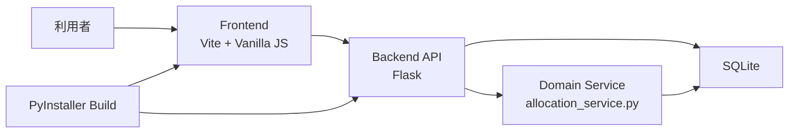
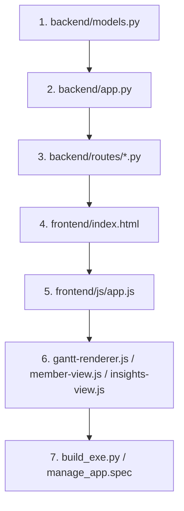
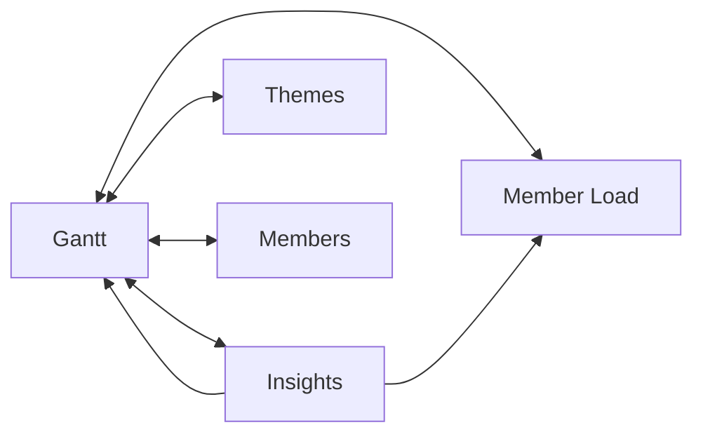
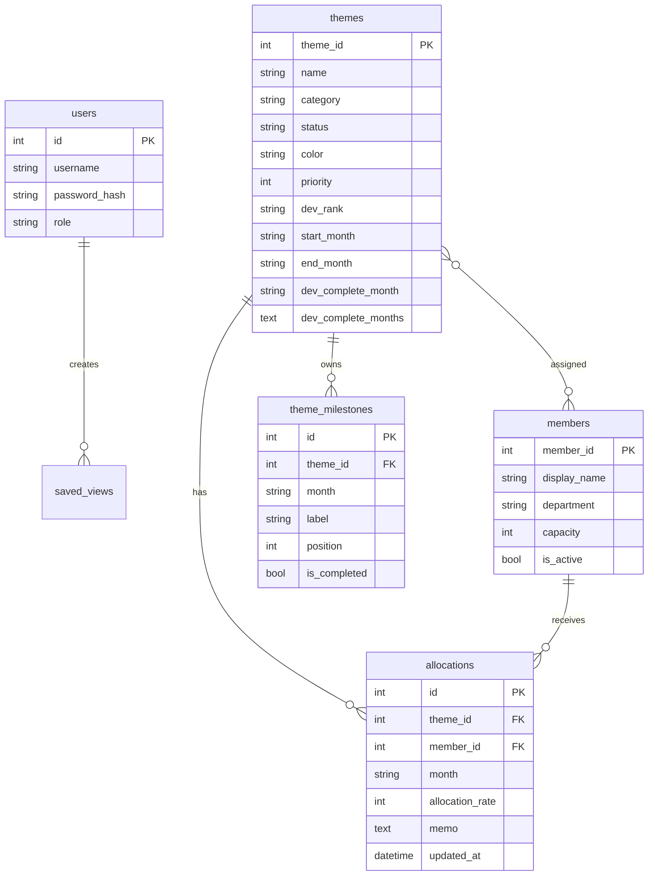
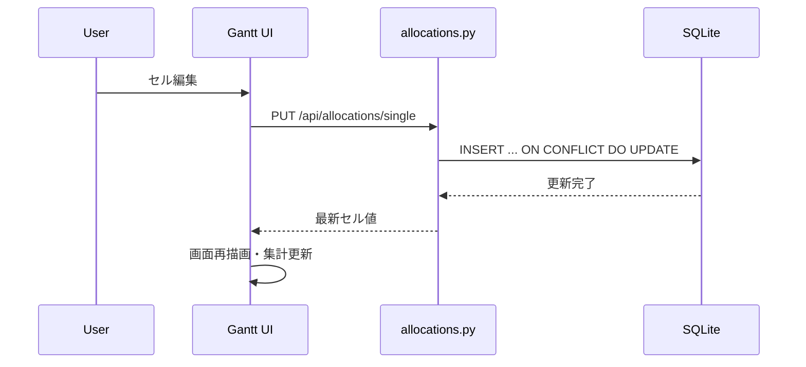
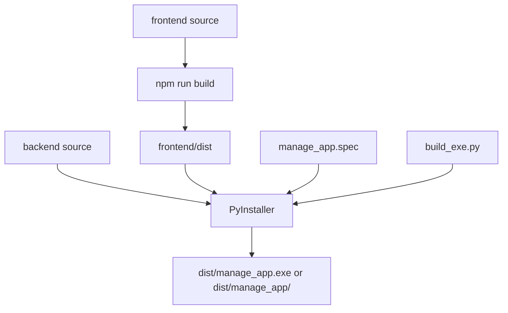
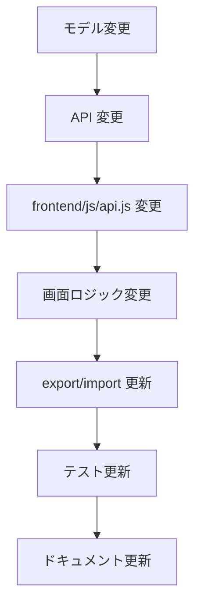

<!--
  Copyright (c) 2026 Masaki Nakai (https://github.com/masakinakai3)
  Released under the MIT license
  https://opensource.org/licenses/mit-license.php
-->
# Software Design

本書は、`Resource Manager` の設計全体を新人エンジニア向けに整理した主設計書です。  
実装を読み始める前に「このソフトが何を解くのか」「どのファイルがどの責務を持つのか」「どこを変更すると何に影響するのか」をつかめることを目的としています。

## 1. このソフトウェアは何か

`Resource Manager` は、テーマ単位の計画、メンバー配員、月次アロケーション、負荷警告、スナップショット、保存ビュー、JSON バックアップ、CSV / XLSX エクスポート、インサイト分析をひとつのデスクトップ向けアプリで扱うためのリソース計画ツールです。

### 1.1 一言でいうと

| 観点 | 内容 |
|---|---|
| 主用途 | テーマごとの配員計画と、メンバー負荷の見える化 |
| 利用者 | 開発マネージャ、PM、リソース管理者、リードエンジニア |
| 主画面 | Gantt、Member Load、Insights、Themes、Members |
| 配布形態 | Windows 向け PyInstaller EXE |
| データ保存 | ローカル SQLite (`backend/database.db` または EXE 配置先の `database.db`) |

### 1.2 ユーザーができること

| 機能カテゴリ | できること |
|---|---|
| テーマ管理 | テーマ作成、状態管理、優先度、開発ランク、期間、マイルストーン設定、複数開発完了月、担当メンバー紐付け（一括割当含む） |
| メンバー管理 | メンバー作成、部署、稼働率、アクティブ/非アクティブ管理 |
| 配員編集 | Gantt セル編集、ドラッグ&ドロップ、複数セル貼り付け、メモ保存、**Undo / Redo** |
| 負荷確認 | メンバー別負荷一覧、過負荷警告、余力確認 |
| 分析 | シナリオシミュレーション、将来不足予測、部署偏り |
| 復元/共有 | 保存ビュー、スナップショット、JSON バックアップの入出力 |
| 出力 | CSV / XLSX / JSON エクスポート |

## 2. 全体アーキテクチャ

### 2.1 システム俯瞰

### 2.2 実行形態

| モード | 実行形態 | 主な用途 |
|---|---|---|
| 開発 | Flask + Vite を別起動 | 画面開発、API 開発、デバッグ |
| パッケージ確認 | `build_exe.py --profile dev` | `onedir` で高速な疎通確認 |
| 配布 | `build_exe.py` | 単一 EXE の `release` ビルド |

### 2.3 ディレクトリ責務

| パス | 役割 |
|---|---|
| `backend/` | Flask アプリ、モデル、ルート、サービス、DB 初期化 |
| `frontend/` | UI 本体、状態管理、画面ロジック、スタイル、Vitest |
| `tests/` | Python 側の回帰テスト |
| `docs/` | 仕様・運用・設計補助ドキュメント |
| `build_exe.py` | frontend build + PyInstaller 実行の統合スクリプト |
| `manage_app.spec` | PyInstaller のパッケージ定義 |

## 3. 技術スタック概略

### 3.1 採用技術一覧

| レイヤ | 技術 | このプロジェクトでの役割 |
|---|---|---|
| フロントエンド | Vanilla JavaScript | フレームワークを使わずに画面制御を実装 |
| フロントエンド開発サーバ | Vite | 開発時の配信と本番用バンドル生成 |
| UI | HTML / CSS | 単一ページアプリのレイアウトとスタイル |
| バックエンド | Flask | REST API と静的ファイル配信 |
| 認証 | Flask-Login | セッション管理、ログイン状態判定 |
| ORM | Flask-SQLAlchemy / SQLAlchemy | モデル定義と DB アクセス |
| DB | SQLite | ローカル完結の永続化 |
| Excel 出力 | openpyxl | XLSX ファイル出力 |
| API ドキュメント | Flasgger | Swagger UI による API 仕様書自動生成 |
| テスト | pytest / Vitest | Python / JavaScript の回帰確認 |
| 配布 | PyInstaller | Windows 向け EXE 化 |

### 3.2 技術選定の意図

| 技術 | 選定理由 |
|---|---|
| Flask | 小規模～中規模のローカル業務ツールに対して構成が軽い |
| SQLite | サーバ不要で単体配布しやすい |
| Vanilla JS | ビルド依存と学習コストを抑えつつ高速に UI 実装できる |
| Vite | 開発体験とビルド速度が高い |
| PyInstaller | Python アプリを Windows 配布物にしやすい |

## 4. まず読むべき主ファイル

### 4.1 入口ファイル

| 優先 | ファイル | 読む目的 |
|---|---|---|
| 1 | `backend/app.py` | アプリ初期化、Blueprint 登録、DB 初期化、起動条件を理解する |
| 2 | `backend/models.py` | 業務データの全体像をつかむ |
| 3 | `frontend/index.html` | どんな画面があるかを俯瞰する |
| 4 | `frontend/js/app.js` | 画面遷移と UI 初期化のハブを理解する |
| 5 | `frontend/js/api.js` | フロントエンドが叩く API 契約を把握する |
| 6 | `frontend/js/gantt/gantt-renderer.js` | このアプリの中核 UI を理解する |
| 7 | `backend/routes/insights.py` | 分析ロジックの中心を見る |
| 8 | `build_exe.py` | 配布物生成とビルド運用を把握する |

### 4.2 実際の読み順

## 5. 主要コンポーネントと責務

### 5.1 バックエンド

| コンポーネント | 主ファイル | 責務 |
|---|---|---|
| アプリファクトリ | `backend/app.py` | Flask 初期化、CORS、LoginManager、静的配信、マイグレーション、初期管理者作成 |
| モデル | `backend/models.py` | `User`, `Theme`, `ThemeMilestone`, `Member`, `Allocation`, `Snapshot`, `SavedView` 定義 |
| ルート | `backend/routes/*.py` | 画面ごとの API 提供 |
| サービス | `backend/services/allocation_service.py` | テーマ負荷、メンバー負荷、過負荷警告の集計 |
| 分析 | `backend/routes/insights.py` | 内部指標の計算、予測、シナリオ候補の生成 |

### 5.2 フロントエンド

| コンポーネント | 主ファイル | 責務 |
|---|---|---|
| アプリハブ | `frontend/js/app.js` | 初期化、画面切替、モーダル起動、テーマ/メンバー管理、保存ビュー |
| API クライアント | `frontend/js/api.js` | REST API 呼び出しの一元化 |
| Gantt 画面 | `frontend/js/gantt/gantt-renderer.js` | テーブル描画、選択、編集、CSV/XLSX 出力用データ作成 |
| セル編集 | `frontend/js/gantt/gantt-editor.js` | セル内エディタの表示と保存操作 |
| DnD | `frontend/js/gantt/gantt-dnd.js` | ドラッグ&ドロップ移動 |
| メンバー負荷画面 | `frontend/js/member/member-view.js` | メンバー別の集約表示とテーマ内訳 |
| インサイト画面 | `frontend/js/insights-view.js` | 分析結果の可視化と画面間ドリルダウン |
| 共通状態 | `frontend/js/shared-state.js` | `localStorage` と `CustomEvent` による共有状態 |
| UI 共通部品 | `frontend/js/ui.js` | toast、confirm、prompt、busy、通信状態、保存状態表示 |

## 6. 主要画面

### 6.1 画面一覧

| 画面 | 主目的 | 中心ファイル |
|---|---|---|
| Gantt | テーマ×メンバー×月の編集 | `frontend/js/gantt/gantt-renderer.js` |
| Member Load | メンバー単位の負荷確認 | `frontend/js/member/member-view.js` |
| Insights | シナリオシミュレーション、予測、ダッシュボード | `frontend/js/insights-view.js` |
| Themes | テーマ CRUD | `frontend/js/app.js` |
| Members | メンバー CRUD | `frontend/js/app.js` |

### 6.2 画面遷移の考え方

補足:

- `Insights` から `Gantt` / `Member Load` にドリルダウンできる。
- `Themes` / `Members` で登録した内容は `Gantt` と `Member Load` の表示元になる。
- 共有表示条件は `shared-state.js` で保持される。

## 7. データモデル要約

### 7.1 ER 図

### 7.2 設計上のポイント

| テーブル | ポイント |
|---|---|
| `themes` | 旧互換の `milestone_month` / `milestone_label` を保持しつつ、実体は `theme_milestones` に寄せている。`dev_complete_months` は JSON 配列で複数の完了月とその完了状態を保持する |
| `members` | `is_active` により論理的な運用停止を表現する |
| `allocations` | `theme_id + member_id + month` に UNIQUE 制約がある |
| `saved_views` | 画面状態を JSON 文字列として保持する。`view` でどの画面用かを識別する |
| `snapshots` | Gantt 状態の比較用スナップショットを保持する |

## 8. API 全体像

### 8.1 API カテゴリ一覧

| カテゴリ | エンドポイント例 | 用途 |
|---|---|---|
| Auth | `/api/auth/*` | 認証とユーザー管理 |
| Themes | `/api/themes*` | テーマ CRUD と担当紐付け |
| Members | `/api/members*` | メンバー CRUD |
| Allocations | `/api/allocations*` | 配員 CRUD と負荷集計 |
| Insights | `/api/insights/overview` | 分析結果取得 |
| Snapshots | `/api/snapshots*` | Gantt スナップショット保存 |
| Saved Views | `/api/saved-views*` | 表示条件保存 |
| Export / Import | `/api/export/*`, `/api/import/json` | データ入出力 |
| API Docs | `/apidocs` | Swagger UI による API 仕様書 |

### 8.2 配員更新の流れ

## 9. 状態管理

### 9.1 状態の置き場所

| 状態 | 保持先 | 役割 |
|---|---|---|
| 画面フィルタ | `localStorage` + `CustomEvent` | Gantt / Member / Insights 間で共有 |
| 保存ビュー | API + ローカルフォールバック | 表示条件の再利用 |
| オンボーディング状態 | `localStorage` | 初回導線の出し分け |
| 一時 UI 状態 | 各 JS モジュール内変数 | 選択セル、描画キャッシュなど |

### 9.2 設計意図

- 小規模アプリのためグローバル状態管理ライブラリは使わず、`shared-state.js` に集約している。
- 永続化が必要な表示条件は `SavedView` へ保存する。
- 一時的な画面内部状態は各画面モジュールが責務を持つ。

## 10. 配布・ビルド

### 10.1 ビルドパイプライン

### 10.2 ビルド責務

| ファイル | 役割 |
|---|---|
| `build_exe.py` | 依存状態を見ながら frontend build と PyInstaller を統合実行 |
| `manage_app.spec` | dev / release ごとの PyInstaller 生成方式を定義 |
| `pyinstaller_hooks/` | 不要依存の混入抑制などの調整 |

## 11. テスト戦略

### 11.1 テスト構成

| テスト | 対象 |
|---|---|
| `tests/test_models.py` | モデル |
| `tests/test_api.py` | API |
| `tests/test_priority.py` | priority の回帰 |
| `frontend/tests/*.test.js` | Gantt、Member View、date-utils などの画面ロジック |

### 11.2 何を守っているか

| 領域 | 主な回帰対象 |
|---|---|
| 配員更新 | UPSERT、取得、単一更新、複数更新 |
| 画面ロジック | Gantt 表示、編集、ドラッグ&ドロップ |
| 日付処理 | 月境界、表示範囲、集計 |
| モデル | 基本 CRUD と制約 |

## 12. 変更時の着眼点

### 12.1 どこを直せばよいか

| やりたい変更 | 主に触る場所 |
|---|---|
| テーマ属性を追加したい | `backend/models.py`, `backend/routes/themes.py`, `frontend/js/app.js`, 必要なら export/import |
| Gantt の見た目を変えたい | `frontend/index.html`, `frontend/css/gantt.css`, `frontend/js/gantt/gantt-renderer.js` |
| 新しい分析指標を追加したい | `backend/routes/insights.py`, `frontend/js/insights-view.js` |
| 共有表示条件を増やしたい | `frontend/js/shared-state.js`, 対象画面モジュール, `saved_views` |
| 配布物の構成を変えたい | `build_exe.py`, `manage_app.spec`, `README.md` |

### 12.2 影響範囲の典型

## 13. 詳細編

本書は全体地図です。詳細は以下を参照してください。

| 詳細ドキュメント | 内容 |
|---|---|
| [docs/software-design/01-system-overview.md](docs/software-design/01-system-overview.md) | 全体像、ユースケース、実行形態 |
| [docs/software-design/02-backend-design.md](docs/software-design/02-backend-design.md) | Flask、モデル、ルート、サービス、分析ロジック |
| [docs/software-design/03-frontend-design.md](docs/software-design/03-frontend-design.md) | 画面構成、状態管理、主要モジュール |
| [docs/software-design/04-data-and-api.md](docs/software-design/04-data-and-api.md) | データモデル、API、入出力契約 |
| [docs/software-design/05-build-and-operations.md](docs/software-design/05-build-and-operations.md) | ビルド、EXE 化、運用、テスト、保守 |

## 14. 実装ファイルの実パス対応

| 論理名 | 実ファイル |
|---|---|
| アプリ初期化 | `backend/app.py` |
| DB モデル | `backend/models.py` |
| テーマ API | `backend/routes/themes.py` |
| メンバー API | `backend/routes/members.py` |
| 配員 API | `backend/routes/allocations.py` |
| 分析 API | `backend/routes/insights.py` |
| エクスポート API | `backend/routes/export.py` |
| インポート API | `backend/routes/import_data.py` |
| スナップショット API | `backend/routes/snapshots.py` |
| 保存ビュー API | `backend/routes/saved_views.py` |
| アプリハブ | `frontend/js/app.js` |
| API クライアント | `frontend/js/api.js` |
| Gantt | `frontend/js/gantt/gantt-renderer.js` |
| セルエディタ | `frontend/js/gantt/gantt-editor.js` |
| DnD | `frontend/js/gantt/gantt-dnd.js` |
| メンバー負荷 | `frontend/js/member/member-view.js` |
| Insights | `frontend/js/insights-view.js` |
| 共通状態 | `frontend/js/shared-state.js` |
| UI 共通 | `frontend/js/ui.js` |
| HTML 入口 | `frontend/index.html` |
| ビルドスクリプト | `build_exe.py` |
| PyInstaller 定義 | `manage_app.spec` |
