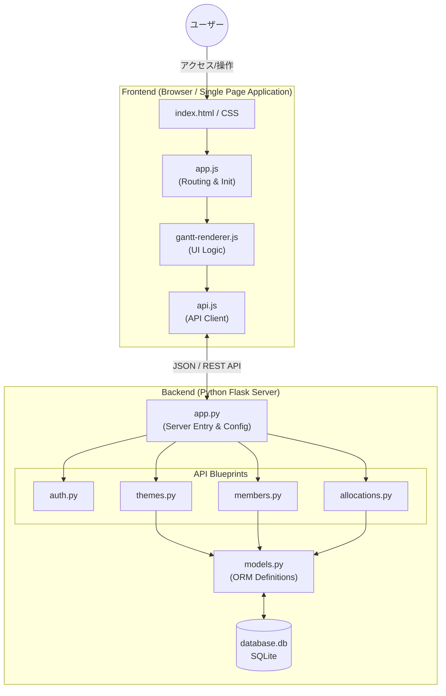
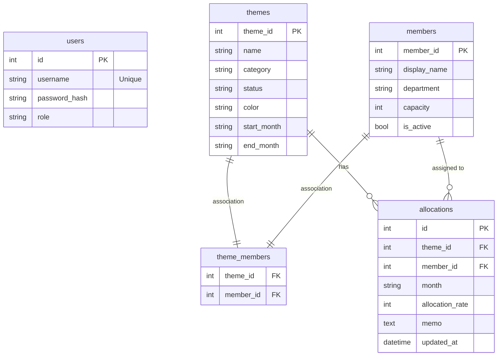
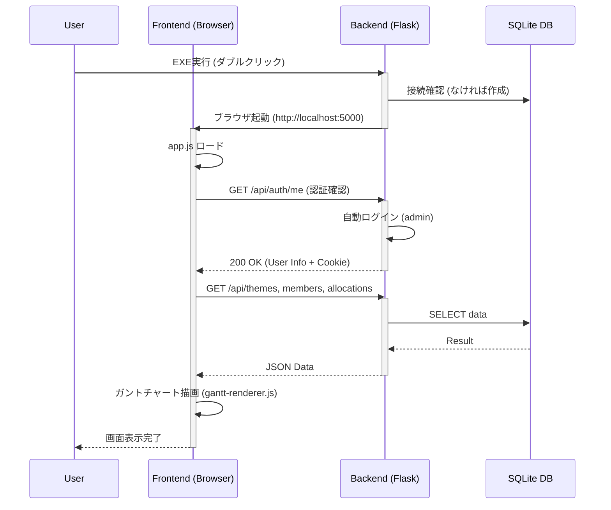

# ソフトウェア詳細設計書 (SoftwareDesign.md)

## 1. システム概要

本システムは、**「Web技術で構築された、配布容易なデスクトップアプリケーション」** をコンセプトに設計されています。
ユーザーのローカル環境で完結して動作し、インストール手順やサーバー構築を不要とすることを最重要視しています。

### 1.1 アーキテクチャ設計思想

本システムは、以下の意図に基づいて **クライアントサイド・レンダリング (CSR) + REST API + ローカルDB** の構成を採用しています。

#### (1) SPA (Single Page Application) 構成の採用
- **目的**: デスクトップアプリと同等の操作性（リッチなUI体験）を提供するため。
- **詳細**: ガントチャートの操作（ドラッグ＆ドロップ、期間の伸縮、セルの直接編集）は、画面遷移を伴う従来のWebアプリケー ションでは実現が困難です。画面遷移を行わず、JavaScriptでDOMを動的に書き換えるSPA構成にすることで、高速で直感的な操作感を実現しました。

#### (2) バックエンドとフロントエンドの疎結合
- **目的**: 役割の明確化と将来的な拡張性。
- **詳細**:
    - **Frontend**: UI描画とユーザー操作のハンドリングに集中。
    - **Backend**: データ整合性の保証（DB操作）とビジネスロジック（負荷計算など）に集中し、APIインターフェースを通じてのみ通信します。これにより、将来的にUIを刷新したり、別のクライアントからDBを利用する場合でもバックエンドへの影響を最小限に抑えられます。

#### (3) スタンドアロン配布 (Single EXE)
- **目的**: 「誰でもすぐに使える」ポータビリティの確保。
- **詳細**: PythonやNode.jsの環境構築は、非エンジニアにはハードルが高い作業です。`PyInstaller` を用いて、Pythonランタイム、依存ライブラリ、ビルド済みフロントエンド資材、データベースエンジン(SQLite)を全て1つの実行ファイル (`.exe`) に封入しました。これにより、ファイルをコピーするだけで動作する「ポータブルアプリ」としての利便性を実現しています。

### 1.2 技術スタック選定理由

各技術は「軽量さ」「配布のしやすさ」「パフォーマンス」を基準に選定しました。

| コンポーネント | 採用技術 | 選定理由・設計思想 |
|---|---|---|
| **言語** | **Python 3.10+** | 可読性が高く保守が容易。標準ライブラリが充実しており、OS操作やファイル処理に強い。`PyInstaller` との親和性が最も高い言語であるため採用。 |
| **フレームワーク** | **Flask 3.x** | **「必要最小限」**: Djangoのような重量級フレームワークは、今回のような単機能アプリにはオーバースペックであり、EXEサイズが増大します。Flaskはマイクロフレームワークであり、必要な機能（ルーティング、DB接続）だけをプラグイン形式で追加できるため、軽量かつ高速に動作します。 |
| **データベース** | **SQLite** | **「サーバーレス」**: 別途 MySQL や PostgreSQL サーバーを立てる必要がなく、単一のファイル (`database.db`) で完結します。ACID特性を備え信頼性が高く、バックアップもファイルをコピーするだけで済むため、ローカル運用に最適です。 |
| **フロントエンド** | **Vanilla JS** | **「ハイパフォーマンス」**: ReactやVueは便利ですが、仮想DOMのオーバーヘッドやバンドルサイズの増大を招きます。本アプリの核心であるガントチャートは、数千個のセルを扱うため、DOMを直接操作する Vanilla JS (素のJavaScript) の方が描画パフォーマンスを細かくチューニングでき、軽量に動作します。 |
| **ビルドツール** | **Vite** | **「高速な開発体験」**: ES Modules をネイティブ利用するため開発サーバーの起動が一瞬で、ホットリロードも高速です。開発効率を最大化するために採用しました。 |
| **ORM** | **SQLAlchemy** | SQLを直接書かず、PythonのクラスとしてDB操作を行うことで、コードの可読性を高め、SQLインジェクション等のセキュリティリスクを排除します。 |

### 1.3 アーキテクチャ構成図

以下の図は、本システムの論理構成とデータフローを示しています。

---

## 2. データベース設計

### 2.1 データベース設計思想

本システムでは、**「ポータビリティ」** と **「データ整合性」** の両立をテーマにデータベースを設計しています。

#### (1) SQLiteの採用とファイルベース運用
- **意図**: サーバー構築不要で配布するため、アプリケーションと同じフォルダにある `database.db` ファイル一つで完結する設計としました。
- **利点**: ユーザーはフォルダごとコピーするだけでバックアップが可能であり、初期化したい場合はファイルを削除するだけで済むという、デスクトップアプリ感覚の運用性を提供します。

#### (2) データの正規化方針 (Allocationsテーブル)
- **意図**: 「月ごとのアサイン」をJSON等の構造化データとして1レコードにまとめるのではなく、`(theme_id, member_id, month)` の最小単位でレコードを分割（正規化）しました。
- **理由**: ガントチャート（テーマ別）と負荷表（メンバー別）の双方で集計を行うためです。レコードを分割しておくことで、「特定月の全メンバー負荷」や「特定テーマの総工数」といった集計が、SQLの `GROUP BY` 句で高速かつ柔軟に実行できます。

#### (3) 物理削除と論理削除の使い分け
- **物理削除**: `Allocation`（アサイン情報）や `ThemeMember`（中間テーブル）は、画面上での「解除」操作と同期して物理削除します。不要なアサインデータを残さないことで、集計時のノイズを防ぎます。
- **論理削除**: `Member` や `Theme` などのマスタデータは、`is_active` フラグ等による論理削除（または削除禁止）を基本としますが、現状はシンプルさを優先し、依存関係（Allocation）がある場合は削除エラーとする整合性制約を設けています。

### 2.2 ER図

### 2.3 テーブル定義

#### users
システム利用者テーブル。現状は `admin` ユーザーのみ運用。

| カラム名 | 型 | 制約 | 説明 |
|---|---|---|---|
| id | Integer | PK | ユーザーID |
| username | String(80) | Not Null, Unique | ログインID |
| password_hash | String(256) | Not Null | ハッシュ化されたパスワード |
| role | String(10) | Not Null | 権限ロール (admin/user) |

#### themes
開発テーマ（プロジェクト）情報。

| カラム名 | 型 | 制約 | 説明 |
|---|---|---|---|
| theme_id | Integer | PK | テーマID |
| name | String(200) | Not Null | テーマ名 |
| category | String(100) | Default '' | カテゴリ（製品群など） |
| status | String(20) | Not Null | 進行状態 (planning, active, completed) |
| color | String(7) | Default '#6366f1' | 表示色 (HEX) |
| start_month | String(7) | Nullable | 開始月 (YYYY-MM) |
| end_month | String(7) | Nullable | 終了月 (YYYY-MM) |

#### members
開発メンバー情報。

| カラム名 | 型 | 制約 | 説明 |
|---|---|---|---|
| member_id | Integer | PK | メンバーID |
| display_name | String(100) | Not Null | 表示名 |
| department | String(100) | Default '' | 所属部署 |
| capacity | Integer | Not Null, Default 100 | 月間稼働可能率 (%) |
| is_active | Boolean | Not Null, Default True | 有効フラグ |

#### allocations
月ごとのテーマへのメンバアサイン（稼働率）。

| カラム名 | 型 | 制約 | 説明 |
|---|---|---|---|
| id | Integer | PK | ID |
| theme_id | Integer | FK, Not Null | テーマID |
| member_id | Integer | FK, Not Null | メンバーID |
| month | String(7) | Not Null | 対象月 (YYYY-MM) |
| allocation_rate | Integer | Not Null, Default 0 | 稼働率 (%) |
| memo | Text | Default '' | メモ |
| updated_at | DateTime | | 更新日時 |

※ `(theme_id, member_id, month)` の組み合わせでユニーク制約 (`uq_allocation`) が設定されている。

---

## 3. バックエンド詳細設計

### 3.1 バックエンド設計思想

Flaskを採用するにあたり、マイクロフレームワークの特性を活かしつつ、保守性を担保するための設計を行っています。

#### (1) Blueprintによる機能分割
- **意図**: アプリケーションが肥大化しても見通しを良くするため、`routes` ディレクトリ配下に機能単位（Themes, Members, Allocations, Auth）でファイルを分割し、Flaskの `Blueprint` 機能を用いてモジュール化しています。
- **利点**: 「メンバー管理に関する修正は `members.py` だけを見れば良い」という状態を維持でき、チーム開発や長期保守での認知負荷を下げています。

#### (2) RESTfulライクなAPI設計
- **意図**: リソース（名詞）と操作（HTTPメソッド）を対応させる標準的な設計を採用しました（例: `GET /themes`, `POST /themes`, `DELETE /themes/<id>`）。
- **理由**: フロントエンド開発者にとって直感的であり、APIの挙動が予測しやすいためです。また、URL構造がシンプルになるため、将来的な機能追加もしやすくなります。

#### (3) シンプルなセッション認証
- **意図**: 複雑なJWT（JSON Web Token）ではなく、Flask標準のセッション管理（Cookieベース）を採用しました。
- **理由**: ブラウザから利用する単一ドメインのアプリであるため、ステートレスなJWTよりも、HttpOnly Cookieを用いたセッション管理の方がXSS（クロスサイトスクリプティング）などの攻撃に対して堅牢であり、かつ実装もシンプルになるためです。

### 3.2 ディレクトリ構成

- `app.py`: アプリケーションファクトリ、静的ファイル配信、自動ログインフック。
- `models.py`: SQLAlchemy モデル定義。
- `routes/`: Blueprint による API ルーティング分割。
  - `auth.py`: 認証系 (Login, Logout, Me)。
  - `themes.py`: テーマ管理 (CRUD, Member Assign)。
  - `members.py`: メンバー管理 (CRUD)。
  - `allocations.py`: アサイン管理 (List, Bulk Update, Warning)。
  - `export.py`: CSV エクスポート。

### 3.3 主要API仕様

すべてのAPIは `/api` プレフィックスを持ちます。

#### Auth (`/api/auth`)
- `POST /login`: ログイン (セッションクッキー発行)。
- `POST /logout`: ログアウト。
- `GET /me`: 現在のログインユーザー情報を取得。

#### Themes (`/api/themes`)
- `GET /`: 全テーマ一覧取得（関連メンバーID含む）。
- `POST /`: テーマ新規作成。
- `PUT /<id>`: テーマ情報更新。
- `DELETE /<id>`: テーマ削除。
- `POST /<id>/members`: メンバーをテーマにアサイン（Allocationレコード作成の前段階）。
- `DELETE /<id>/members/<mid>`: メンバーのアサイン解除（Allocationレコードも削除）。

#### Allocations (`/api/allocations`)
- `GET /`: 期間指定 (`from`, `to`) でアサインデータを取得。
- `PUT /bulk`: 複数レコードの一括更新（Drag & Drop 等で使用）。
  - Body: `[{ theme_id, member_id, month, allocation_rate }, ...]`
  - Upsert ロジックにて処理（既存レコードがあれば更新、なければ作成）。

---

## 4. フロントエンド詳細設計

### 4.1 フロントエンド設計思想

「フレームワークレス」かつ「ハイパフォーマンス」を主眼に置き、DOM操作のオーバーヘッドを最小化する設計を採用しています。

#### (1) Vanilla JSによる直接DOM操作
- **意図**: ReactやVueなどの仮想DOMフレームワークを使用せず、素のJavaScriptで直接DOMを生成・操作します。
- **理由**: ガントチャートは数千〜数万のセル（`
`要素）を描画する必要があり、汎用フレームワークの差分検知処理（Reconciliation）すらオーバーヘッドとなり得ます。必要な箇所（例えばドラッグ中のセルだけ）をピンポイントで更新する最適化を行うため、制御の完全な自由度が確保できるVanilla JSを選択しました。

#### (2) クラスレスな関数型モジュール構成
- **意図**: `class` 構文を極力使わず、`export function` を主体とした関数ベースのモジュール構成としています。
- **理由**: JavaScriptの `this` コンテキストにまつわる複雑さを排除し、関数の入力と出力に着目したシンプルなデータフローを構築するためです。

#### (3) 状態管理の局所化
- **意図**: Reduxのような大掛かりなストアは導入せず、ガントチャート描画に必要なデータ（Themes, Allocations）は `gantt-renderer.js` 内のモジュール変数として保持しています。
- **理由**: アプリの規模が小さく、コンポーネント間の複雑な通信が少ないため、グローバルな状態管理ライブラリを導入するコスト（学習・実装）が見合わないと判断しました。

### 4.2 モジュール構成

- `app.js`: アプリケーションの初期化、ルーティング、ビューの切り替え制御。
- `api.js`: `fetch` API をラップしたバックエンド通信クライアント。
- `gantt/`:
  - `gantt-renderer.js`: ガントチャートの DOM 生成、イベントハンドリング、再描画ロジック。
  - `gantt-editor.js`: セルクリック時のインプレースエディタ (Popover) 制御。
- `css/`:
  - `index.css`: グローバルスタイル、CSS変数（カラーパレット等）。
  - `gantt.css`: ガントチャート固有のスタイル（グリッドレイアウト、セルスタイル）。

### 4.3 状態管理

- **データ保持**: `gantt-renderer.js` 内のモジュールスコープ変数 (`allThemes`, `allMembers` 等) に API から取得したデータを保持。
- **永続化**: ガントチャートの展開/折りたたみ状態 (`collapsedThemes`) は `localStorage` に保存し、リロード時に復元する。

### 4.4 認証フロー (自動ログイン)

1. **Backend**: `before_request` フックで、未認証リクエストに対して `admin` ユーザーを自動的にロードし `login_user` を実行する。
2. **Frontend**: `app.js` 初期化時、`auth.me()` を呼び出してセッションを確認する（基本的には常に成功する）。失敗した場合もダミーユーザーで続行するフェイルセーフを実装。

### 4.5 ガントチャート描画ロジック

1. **データ取得**: `refreshGantt` 関数で `themes`, `members`, `allocations` API を並列実行。
2. **データ加工**:
   - `warningsMap`: メンバー×月ごとの合計負荷を計算し、キャパシティ超過を判定。
   - `memberLoadsMap`: メンバーごとの負荷率マップを作成。
3. **DOM生成**:
   - `renderHeader`: 表示期間 (`visibleMonths`) に基づくヘッダー生成。
   - `renderBody`: テーマごとに以下の行を生成。
     - **親行（テーマ）**: ステータス、カテゴリ、集計セルを表示。
     - **子行（メンバー）**: アサイン済みメンバーごとの稼働率セルを描画。`collapsedThemes` に含まれる場合は非表示 (`hidden-row` クラス)。
4. **イベントバインド**:
   - 生成された DOM に対して、クリック（編集）、ドラッグ＆ドロップ（移動）、ホバー（ツールチップ）のリスナーを設定。

---

## 5. 起動シーケンス

アプリケーション起動時のフローは以下の通りです。

### 5.1 起動フロー
1.  **EXE実行 (Backend起動)**:
    - パッケージ化された `app.exe` (または `app.py`) が起動します。
    - Flaskサーバーがポート5000で立ち上がり、ブラウザで `http://localhost:5000` を開きます。
    - 起動時にデータベース (`database.db`) の存在確認を行い、なければ作成します。

2.  **Frontend初期化**:
    - ブラウザが `index.html` を読み込み、`app.js` が実行されます。
    - `app.js` は `api/auth/me` を叩いて認証状態を確認します。
        - **未認証の場合**: バックエンドはローカル利用を前提として、自動的に `admin` ユーザーとしてログイン処理を行い、セッションCookieを発行します。
    - 認証成功後、`gantt-renderer.js` が初期化され、必要なマスタデータ（Theme, Member, Allocation）を一括取得して描画を開始します。

### 5.2 シーケンス図

### 5.3 フロントエンド・バックエンドの役割とデータ連携

起動シーケンスにおける両者の責務とデータの流れは以下の通りです。

#### (1) Frontend (JS) の役割
- **UIの実装**: HTML/CSS/JSによる画面の構築とユーザーインタフェースの提供。
- **データ取得**: 起動時にバックエンドのAPIを呼び出し、必要な初期データ（ユーザー情報、テーマ一覧、メンバー一覧、アサイン状況）を取得します。
- **ルーティング**: クライアントサイドでの画面遷移（表示切り替え）を制御します。

#### (2) Backend (Python/Flask) の役割
- **静的ファイル配信**: EXE化された状態ではWebサーバーとして機能し、フロントエンドの資材 (`index.html`, `js/`, `css/`) を配信します。
- **API提供**: フロントエンドからのリクエストに対し、JSON形式でデータを返却します。
- **DB操作**: SQLiteデータベースへの接続、クエリ実行、データ整合性の保証を行います。
- **セッション管理**: 起動時の自動ログイン処理や、APIリクエストごとの認証状態チェックを行います。

#### (3) データ連携
- **通信プロトコル**: HTTP (Standard Web API)
- **データ形式**: JSON
- **主要なエンドポイント**:
    - `GET /api/auth/me`: ログインユーザー情報の取得
    - `GET /api/themes`: テーマ一覧の取得
    - `GET /api/members`: メンバー一覧の取得
    - `GET /api/allocations`: アサイン情報の取得

---

## 6. 画面描画フロー

本システムはSPA (Single Page Application) として動作し、画面遷移なしでDOMを動的に書き換えます。主要な描画処理は以下の通りです。

### 6.1 共通描画アーキテクチャ
- **エントリポイント**: `app.js` がアプリケーション全体のコントローラーとして機能します。
- **ルーティング**: ハッシュルーティング等は使用せず、メモリ内の `currentView` 変数とDOMの `hidden` 属性切り替えによってビューを制御します。
- **データ取得**: 画面切り替え時に `refreshGantt()` や `refreshMemberView()` を呼び出し、並列非同期通信 (`Promise.all`) で必要な最新データを一括取得して再描画します。

### 6.2 ガントチャート画面 (`gantt-renderer.js`)
最大の計算コストがかかる画面であり、以下のステップで最適化された描画を行います。

1.  **データ準備**:
    - Backendから `Themes`, `Members`, `Allocations` を取得。
    - `Allocations` を基に「メンバー×月」ごとの負荷率を集計し、キャパシティ超過(`warningsMap`)を事前に計算します。
2.  **DOM構築**:
    - **ヘッダー**: `scale` (1ヶ月/3ヶ月/6ヶ月) に応じて月ヘッダーを生成。
    - **ボディ**:
        - `Themes` ループ: 各テーマの親行（進捗バー、ステータス）を生成。
        - **折りたたみ判定**: `collapsedThemes` (localStorage永続化) に含まれるテーマの子行は `hidden-row` クラスを付与して非表示にし、DOM生成コストを削減しません（生成はするが表示はCSSで制御）。※実装上は生成していますが、将来的なパフォーマンスチューニングの余地として残しています。
        - `Members` ループ: 各テーマにアサインされたメンバー行を生成。
        - **セル生成**: 各月ごとに `
` セルを生成し、負荷率 (`allocation_rate`) に応じてクラス (`rate-low`, `rate-over` 等) を適用して色分けします。
3.  **インタラクション**:
    - **ドラッグ＆ドロップ**: `mousedown`, `mousemove`, `mouseup` イベントをセルに直接バインドし、アサインの移動（メンバー変更）や期間移動（月変更）を実現します。
    - **インプレース編集**: クリック時に `gantt-editor.js` の `openCellEditor` を呼び出し、その場に数値入力用Popoverを展開します。

### 6.3 メンバー負荷画面 (`member-view.js`)
全テーマを横断したメンバーごとの総負荷を表示します。

1.  **集計ロジック**:
    - 取得した `Allocations` を「メンバーID」と「月」をキーにグルーピングします。
    - テーマごとの内訳（テーマ名、色、工数）を保持し、合計工数を計算します。
2.  **警告表示**:
    - 合計工数がメンバーの `capacity` (基本100%) を超えた場合、セルを赤く強調表示 (`load-over` クラス) します。
3.  **詳細ポップアップ**:
    - セルをクリックすると、その月のテーマ別工数内訳をポップアップ表示します。

### 6.4 管理モーダル
- `theme-list` や `member-list` からの操作で、HTML文字列テンプレートを用いて動的にモーダル (`div#modal-overlay`) を生成します。
- フォームの値は直接 `doucment.getElementById` で取得し、APIクライアント (`api.js`) を通じて送信します。

### 6.5 フロントエンド・バックエンドの役割とデータ連携

描画および更新処理における責務とデータの流れは以下の通りです。

#### (1) 描画フェーズ (Read)
- **Frontend (JS)**:
    - 表示期間 (`startMonth` 〜 `visibleCount`) を計算し、クエリパラメータとしてBackendに送信します。
    - 取得したJSONデータをメモリ上 (`allAllocations` 等) に展開し、DOM要素としてレンダリングします。
    - パフォーマンス維持のため、アサインのないセルは空の `
` とし、イベントリスナーのみを軽量にバインドします。
- **Backend (Python)**:
    - リクエストされた期間 (`from`, `to`) に基づき、SQLiteから `Allocations` テーブルをフィルタリングして返却します (`WHERE month >= ? AND month <= ?`)。
    - 単純なCRUDに徹し、HTML生成は行いません。

#### (2) 更新フェーズ (Write)
- **Frontend (JS)**:
    - **ドラッグ＆ドロップ**: 操作完了時に変更差分（移動元と移動先）を検知し、`Allocation` オブジェクトの配列を作成します。
    - **API送信**: `PUT /api/allocations/bulk` に対してJSON配列をPOSTします。
    - **楽観的UI更新**: 複雑な同期ズレを防ぐため、現在は「API成功後に `refreshGantt()` で全再描画」する戦略を採用しており、楽観的更新（API待ちの間に見た目だけ変える処理）はあえて行っていません。
- **Backend (Python)**:
    - `bulk` エンドポイントでトランザクションを開始します。
    - 送信されたレコードを1件ずつ Upsert (既存なら更新、なければ挿入) 処理し、稼働率が 0 になったレコードは自動的に削除します。

#### (3) データフロー詳細 (Action Mapping)

| ユーザー操作 | Frontend Action | API Endpoint | Data Payload (Request) |
|---|---|---|---|
| **画面表示/期間変更** | `refreshGantt()` | `GET /api/allocations` | `?from=2024-01&to=2025-06` |
| **アサイン追加** | `assignMember()` | `POST /api/themes/<id>/members` | `{ member_id: 123 }` |
| **アサイン移動 (D&D)** | `onMouseUp` | `PUT /api/allocations/bulk` | `[{theme_id:1, member_id:2, month:'2024-04', allocation_rate:0}, ...]` |
| **数値直接入力** | `saveCell()` | `PUT /api/allocations/bulk` | `[{theme_id:1, member_id:2, month:'...', allocation_rate:50}]` |
| **テーマ作成** | `saveTheme()` | `POST /api/themes` | `{ name: "New Project", ... }` |

---

## 7. フロントエンド実装詳細

各JavaScriptモジュールの役割と主要な関数は以下の通りです。

### 7.1 ファイル構成一覧 (`frontend/js/`)

| ファイルパス | 役割・分類 | 主な責務 |
|---|---|---|
| `app.js` | **App Entry** | アプリ初期化、ルーティング制御、イベント委譲のルート。 |
| `api.js` | **API Client** | `fetch` ラッパー。Backend APIへのリクエストを透過的に扱う。 |
| `gantt/gantt-renderer.js` | **Core Logic** | ガントチャートのメイン描画、DOM生成、イベントバインド。 |
| `gantt/gantt-editor.js` | **UI Component** | セルクリック時のインプレースエディタ (Popover) 制御。 |
| `gantt/gantt-dnd.js` | **Legacy/Unused** | (旧) ドラッグ＆ドロップ実装。現在は `gantt-renderer.js` に統合済みのため未使用。 |
| `member/member-view.js` | **Sub View** | メンバー負荷確認画面の描画ロジック。 |
| `utils/date-utils.js` | **Utility** | 日付計算、月文字列操作、期間判定ロジック。 |

### 7.2 主要モジュールの詳細

#### (1) `gantt-renderer.js`
ガントチャートの描画と操作を一手に引き受ける最重要モジュールです。

- **`initGantt()` / `refreshGantt()`**:
    - データ取得 (`themes`, `members`, `allocations`)。
    - 警告判定 (`allocations.warnings`)。
    - `renderHeader()` / `renderBody()` によるDOM再構築。
- **`setupDragAndDrop()`**:
    - セルに対するマウスイベント (`mousedown`, `mousemove`, `mouseup`) を管理。
    - ドラッグ中のGhost要素表示、ドロップ判定、API送信 (`allocations.bulkUpdate`) を行う。

#### (2) `api.js`
バックエンドとの通信を抽象化し、各画面から `fetch` を直接呼ばないように設計されています。

- **`request(endpoint, options)`**:
    - 共通のエラーハンドリング（ネットワークエラー、非200系レスポンス）。
    - JSONのシリアライズ・デシリアライズ。
- **リソース別オブジェクト**:
    - `themes`: `.list()`, `.create()`, `.update()`, `.assignMember()`
    - `members`: `.list()`, `.create()`, `.update()`
    - `allocations`: `.list()`, `.bulkUpdate()`, `.memberLoads()`

#### (3) `app.js`
アプリケーションの「状態」と「画面」を管理します。

- **`currentUser`**: ログインユーザー情報。
- **`switchView(viewName)`**: ナビゲーションと連動して、DOMの表示/非表示を切り替える。
- **管理モーダル**: `initThemeManagement`, `initMemberManagement` により、動的にモーダルを生成してCRUD操作を行う。

---

## 8. バックエンド実装詳細

各Pythonモジュールの役割と主要な関数は以下の通りです。

### 8.1 ファイル構成一覧 (`backend/`)

| ファイルパス | 役割・分類 | 主な責務 |
|---|---|---|
| `app.py` | **App Entry** | Flaskアプリ初期化、静的ファイル配信設定、SPA用ルート定義。 |
| `database.py` | **DB Config** | SQLAlchemyインスタンス作成、SQLite接続設定。 |
| `models.py` | **ORM Models** | データベース定義 (`User`, `Member`, `Theme`, `Allocation`)。 |
| `routes/auth.py` | **API Route** | 認証関連 (ログイン、ログアウト、セッション確認)。 |
| `routes/themes.py` | **API Route** | テーマ管理 (一覧取得、作成、編集)。 |
| `routes/members.py` | **API Route** | メンバー管理 (一覧取得、作成、編集)。 |
| `routes/allocations.py` | **API Route** | アサイン管理 (一括更新、メンバー負荷取得)。 |

### 8.2 主要モジュールの詳細

#### (1) `app.py`
アプリケーションのエントリーポイントです。
- **SPA対応**: `/` および `/assets/<path>` へのリクエストに対し、`frontend/dist` 配下の静的ファイルを返します。
- **API登録**: `routes` パッケージ配下のBlueprint (`auth_bp`, `api_bp` 等) を登録します。

#### (2) `models.py`
データベースのスキーマ定義を行います。
- **`Allocation` モデル**: 複合主キー (`theme_id`, `member_id`, `month`) を持ち、多対多の関係性とアサイン率を管理します。

#### (3) `routes/allocations.py`
ガントチャートのデータの読み書きを担う核心部分です。
- **`bulk_update_allocations()`**:
    - フロントエンドから送られた大量のアサイン変更差分をトランザクション内で一括処理します。
    - `0%` のアサインは物理削除し、それ以外はUpsertを行います。

---

## 9. ビルド・デプロイ設計

### 8.1 EXE化プロセス

`build_exe.py` スクリプトにより自動化されています。

1. **Frontend Build**: `npm run build` を実行し、`frontend/dist` に静的ファイルを生成。
2. **Backend Config**: Flask アプリは、実行環境 (`sys.frozen`) を検知し、静的ファイルの参照先を `dist` または埋め込みリソース (`_MEIPASS`) に切り替える。
3. **PyInstaller**: `pyinstaller` コマンドを実行。
   - `--add-data`: フロントエンドの `dist` ディレクトリを含める。
   - `--onefile`: 単一の EXE ファイルを出力する。
