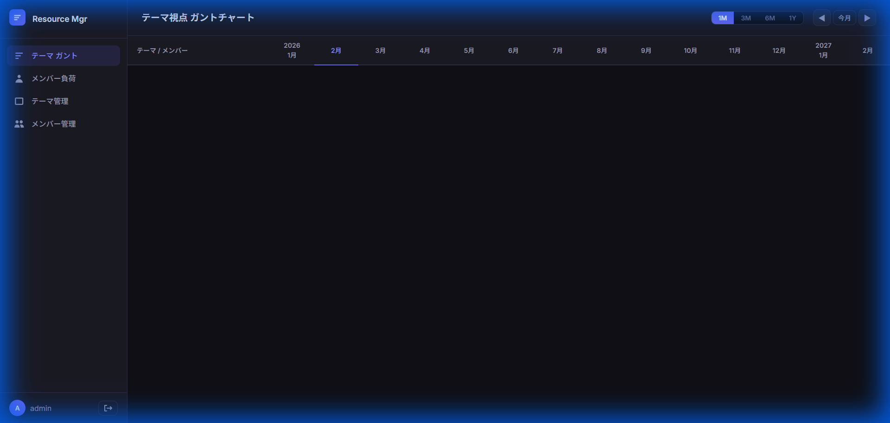
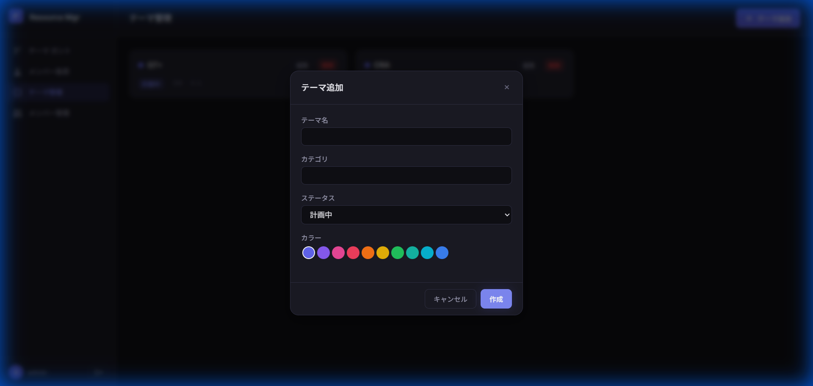

# リソース管理ツール ユーザーマニュアル

---

## 目次

1. [はじめに](#1-はじめに)
2. [環境構築・起動方法](#2-環境構築起動方法)
3. [ログイン](#3-ログイン)
4. [画面構成](#4-画面構成)
5. [テーマ管理](#5-テーマ管理)
6. [メンバー管理](#6-メンバー管理)
7. [テーマ視点ガントチャート](#7-テーマ視点ガントチャート)
8. [メンバー負荷表](#8-メンバー負荷表)
9. [超過警告について](#9-超過警告について)
10. [ユーザー管理（管理者向け）](#10-ユーザー管理管理者向け)
11. [トラブルシューティング](#11-トラブルシューティング)

---

## 1. はじめに

### 本ツールの目的

リソース管理ツールは、**開発テーマ（案件）ごとの人員配置（誰が・いつ・何割）を可視化**し、リソース計画の調整を支援するWEBアプリケーションです。

### 主な機能

| 機能 | 概要 |
|---|---|
| テーマ管理 | 開発テーマの作成・編集・一覧表示 |
| メンバー管理 | 開発メンバーの作成・編集・一覧表示 |
| テーマ視点ガント | テーマ × メンバー × 月単位の割当を表形式で可視化 |
| メンバー負荷表 | メンバーごとの月次負荷率を集計・表示 |
| CSVエクスポート | 表示中のガントデータをCSV形式で出力（NEW） |
| 超過警告 | 月次負荷率が100%を超えた場合の視覚的な警告 |
| ドラッグ＆ドロップ | ガント上での割当期間の移動 |

### データ規模

- 開発テーマ：最大 50
- 開発メンバー：最大 50
- 期間：最大 5年（60か月）
- 最小単位：1か月（例：`26-02`）

---

## 2. 環境構築・起動方法

### 前提条件

- **Python 3.10以上** がインストールされていること
- **Node.js 18以上** がインストールされていること

### 初回セットアップ

#### バックエンドの準備

```bash
cd backend
pip install -r requirements.txt
```

#### フロントエンドの準備

```bash
cd frontend
npm install
```

### 起動

2つのターミナルを開いて、それぞれ以下を実行します。

#### ターミナル1：バックエンドサーバー

```bash
cd backend
python app.py
```

起動後、`http://127.0.0.1:5001` でAPIサーバーが起動します。

#### ターミナル2：フロントエンドサーバー

```bash
cd frontend
npm run dev
```

起動後、`http://localhost:5173` でフロントエンドが起動します。

### アクセス

ブラウザで **http://localhost:5173/** を開いてください。

---

## 3. ログイン

アプリケーションを開くとログイン画面が表示されます。

### 初期アカウント

| ユーザー名 | パスワード | 権限 |
|---|---|---|
| `admin` | `admin` | 管理者（Admin） |

### 割り当て手順（アサイン）

テーマへのメンバーの割り当ては、**「テーマ ガント」画面**で行います。

1. 「テーマ ガント」画面を開きます。
2. 対象のテーマ名の右側にある **「＋」ボタン**（ホバーすると表示されます）をクリックします。
3. 追加したいメンバーを一覧から選択します。
4. テーマの下にメンバーの名前が表示されます。
5. 対象の月セルをクリックして割当率（%）を入力します。

> [!TIP]
> アサインされていないメンバーでも、過去に割当データが存在する場合は自動的に表示されます。

### ログイン手順

1. **ユーザー名**欄に `admin` を入力
2. **パスワード**欄に `admin` を入力
3. **「ログイン」**ボタンをクリック

> **⚠️ セキュリティ上の注意**
> 初回ログイン後は、パスワードを変更することを推奨します。

### ログアウト

- 画面左下のユーザー名横にある **ログアウトアイコン（→）** をクリック

---

## 4. 画面構成

ログイン後、左側に**サイドバー**、右側に**メインコンテンツ**が表示されます。

### サイドバー

| メニュー | 機能 |
|---|---|
| **テーマ ガント** | テーマ視点のガントチャート表示 |
| **メンバー負荷** | メンバーごとの月次負荷率表示 |
| **テーマ管理** | テーマの作成・編集・削除 |
| **メンバー管理** | メンバーの作成・編集・削除 |

メニューをクリックすると、対応する画面に切り替わります。



---

## 5. テーマ管理

テーマ（開発案件）の作成・編集・削除を行います。

### テーマ一覧

サイドバーの **「テーマ管理」** をクリックすると、登録されたテーマがカード形式で一覧表示されます。

各カードには以下の情報が表示されます：
- **テーマ名**（カラードット付き）
- **ステータス**（計画中/進行中/完了/保留）
- **カテゴリ**
- **担当人数**
- **期間**（例：`26-04 〜 26-12`）

### テーマの追加

1. **「テーマ追加」** ボタンをクリック
2. モーダルダイアログが表示されます



3. 以下の項目を入力します：

| 項目 | 必須 | 説明 |
|---|---|---|
| テーマ名 | ✅ | 開発テーマの名称 |
| カテゴリ | — | 分類（任意のテキスト） |
| ステータス | — | 計画中 / 進行中 / 完了 / 保留（初期値：計画中） |
| カラー | — | ガント表示時の識別色（丸をクリックして選択） |

4. **「作成」** ボタンをクリックして保存

### テーマの編集

1. テーマカードの **「編集」** ボタンをクリック
2. モーダルで各項目を変更
3. **「更新」** ボタンをクリック

### テーマの削除

1. テーマカードの **「削除」** ボタンをクリック
2. 確認ダイアログで **「OK」** をクリック

> **⚠️ 注意**
> テーマを削除すると、そのテーマに関連する**すべての割当データも削除**されます。

---

## 6. メンバー管理

開発メンバーの作成・編集・削除を行います。

### メンバー一覧

サイドバーの **「メンバー管理」** をクリックすると、登録されたメンバーがカード形式で一覧表示されます。

各カードには以下の情報が表示されます：
- **表示名**
- **所属**
- **容量**（デフォルト100%）
- **ステータス**（有効/無効）

### メンバーの追加

1. **「メンバー追加」** ボタンをクリック
2. モーダルダイアログが表示されます
3. 以下の項目を入力します：

| 項目 | 必須 | 説明 |
|---|---|---|
| 表示名 | ✅ | メンバーの名前 |
| 所属 | — | 部署・チーム名（任意） |
| 容量（%） | — | 月あたり投入可能な総量（初期値：100%） |

4. **「作成」** ボタンをクリックして保存

### メンバーの編集

- メンバーカードの **「編集」** ボタンをクリック
- モーダルで各項目を変更（有効/無効の切り替えも可能）
- **「更新」** ボタンをクリック

### 容量（Capacity）について

- 容量はメンバーが月あたり投入可能な総量を表します
- デフォルトは **100%**
- 例：パートタイムメンバーの場合、容量を **50%** に設定できます
- 月次負荷率が容量を超えると**警告表示**されます

---

## 7. テーマ視点ガントチャート

テーマ × メンバー × 月の割当をガントチャート形式で表示する、本ツールのメイン画面です。

### 画面レイアウト

```
┌─────────────────────────────────────────────────────────┐
│ [スケール: 1M | 3M | 6M | 1Y]    [◀ 前へ | 今月 | 次へ ▶]  │
├──────────┬──────┬──────┬──────┬──────┬──────┬──────┤
│ テーマA   │ 1月  │ 2月  │ 3月  │ 4月  │ 5月  │ 6月  │
│  合算     │ 150% │ 200% │ 100% │      │      │      │
│  ▶ 田中   │  50% │  80% │  50% │      │      │      │
│  ▶ 鈴木   │ 100% │ 120% │  50% │      │      │      │
├──────────┼──────┼──────┼──────┼──────┼──────┼──────┤
│ ▶ テーマB │  80% │  80% │      │  60% │  60% │      │
└──────────┴──────┴──────┴──────┴──────┴──────┴──────┘
```

### 行の構成

| 行タイプ | 説明 |
|---|---|
| **テーマ合算行**（サマリ行） | テーマ全体の月別負荷率合計（全メンバーの合算） |
| **メンバー別行**（詳細行） | 各メンバーの月別割当率 |

### 折りたたみ操作

- テーマ名の左にある **▶** をクリックするとメンバー行の表示/非表示を切り替えられます
- **折りたたみ時**：テーマ合算行のみ表示
- **展開時**：テーマ合算行 ＋ メンバー別行を表示

### スケール切替

画面右上のスケール切替ボタンで時間軸の表示粒度を変更できます。

| ボタン | 表示 | 集約方法 |
|---|---|---|
| **1M** | 月別 | そのまま表示 |
| **3M** | 四半期 | 3ヶ月の平均負荷% |
| **6M** | 半期 | 6ヶ月の平均負荷% |
| **1Y** | 年度 | 12ヶ月の平均負荷% |

> **ℹ️ ポイント**
> データは常に月単位で保存されます。3M/6M/1Y は表示を集約するだけで、データの粒度は変わりません。

### 期間ナビゲーション

| ボタン | 動作 |
|---|---|
| **◀** | 表示期間を前方にスクロール |
| **今月** | 現在月を中心に表示を戻す |
| **▶** | 表示期間を後方にスクロール |

### 割当率の入力・編集

メンバー行のセルをクリックすると、**セルエディタ**（ポップアップ入力欄）が表示されます。

1. セルをクリック
2. 数値入力欄に割当率（0〜100%）を入力
3. **Enter** キーまたは **「OK」** ボタンで確定

### メンバーのアサイン・解除

- **アサイン（追加）**：テーマ名の右側にある **「＋」** ボタンをクリックし、メンバーを選択します。
- **解除（削除）**：メンバー名の右側にある **「×」** ボタンをクリックします。（※割当データは削除されませんが、このテーマの表示からは消えます）

### テーマ期間の変更

テーマ名の横に表示されている期間（例：`26-04 〜 26-12`）をクリックすると、**期間エディタ**が表示されます。

1. 期間（または「期間未設定」）をクリック
2. 開始年月と終了年月を選択（年月指定のインプットが表示されます）
3. **「保存」** ボタンをクリックして確定

> [!NOTE]
> 期間を設定していない場合、そのテーマに紐づく過去の割当データから自動的に最小・最大月が算出され表示されます。

### CSVエクスポート

現在のガントチャートの表示データをCSV形式でダウンロードできます。

1. 画面右上の **「CSV出力」** ボタンをクリックします。
2. 表示中のスケール（1M/3M等）および期間に基づいたCSVファイルがダウンロードされます。
3. CSVには「テーマ名」「内訳（合算/メンバー名）」「ステータス」「各月の割当率」が含まれます。

> [!TIP]
> Excelなどで開く際、文字化けを防ぐために「UTF-8 (BOM付き)」形式で出力されます。

### ドラッグ＆ドロップ操作

メンバー行の割当セル（値があるセル）をドラッグして別の月にドロップすることで、割当を移動できます。

1. 割当が入力されたセルをマウスでドラッグ開始
2. 移動先の月セルにドロップ
3. 元の月の割当は削除され、移動先に同じ割当率が登録されます

### セルの色分け

| 色 | 意味 |
|---|---|
| 無色 | 0%（割当なし） |
| 薄い色 | 1〜30% |
| 紫色（薄） | 31〜60% |
| 紫色（濃） | 61〜99% |
| 緑色 | 100% |
| **赤色** | **100%超過（警告）** |

---

## 8. メンバー負荷表

メンバーごとの月次合計負荷率を一覧表示する画面です。

### 表示内容

- 各メンバーの月別合計負荷率（全テーマの割当率の合算）
- メンバー名の右に容量（%）が表示されます

### 操作方法

#### スケール切替・期間ナビゲーション

ガント画面と同様に、1M/3M/6M/1Y のスケール切替と ◀/今月/▶ の期間ナビゲーションが利用できます。

#### テーマ別内訳の確認

1. メンバー負荷表の**セルをクリック**
2. そのメンバー × その月の**テーマ別内訳ポップアップ**が表示されます
3. 各テーマの名前と割当率、合計が確認できます
4. ポップアップ外をクリックすると閉じます

### セルの色分け

| 色 | 意味 |
|---|---|
| 無色 | 割当なし |
| 薄いテキスト | 〜30% |
| 紫色 | 31〜60% |
| 緑色 | 61〜99% |
| 緑色（太字） | 100% |
| **赤色 ⚠** | **容量超過** |

---

## 9. 超過警告について

### 警告の発生条件

メンバーの月次合計負荷率が**容量（Capacity）を超過**した場合に警告が表示されます。

```
判定式：member_month_load(%) > capacity(%)
```

- デフォルト容量は **100%**
- 例：田中さんが 3月に テーマA 50% ＋ テーマB 70% = **合計120%** → **20%超過の警告**

### 警告の性質

- 超過は**警告のみ**で、入力・保存・表示を**制限しません**
- 強制ブロックは行いません。運用判断に委ねます

### テーマ視点ガントでの表示

- 超過しているメンバー×月のセルが**赤色**になります
- セル右上に **⚠ アイコン**が表示されます
- ホバーで「合計 120%（+20% 超過）」のツールチップが表示されます

### メンバー負荷表での表示

- 超過セルが**赤色背景**になります
- **⚠ アイコン**が表示されます
- セルクリックでテーマ別内訳を確認でき、超過量が表示されます

---

## 10. ユーザー管理（管理者向け）

### 権限モデル

| 権限 | できること |
|---|---|
| **管理者（Admin）** | メンバー・テーマの追加/編集/削除、全割当の編集、ユーザー管理 |
| **一般利用者（User）** | 閲覧（編集可否は運用で選択） |

### ユーザーの追加

管理者ユーザーは、API を通じて新しいユーザーを追加できます（現時点ではAPI経由のみ）。

```bash
curl -X POST http://localhost:5001/api/auth/users \
  -H "Content-Type: application/json" \
  -b "session=<セッションID>" \
  -d '{"username": "user1", "password": "password123", "role": "user"}'
```

---

## 11. トラブルシューティング

### よくある問題

| 症状 | 原因 | 対処法 |
|---|---|---|
| ログイン画面が表示されない | フロントエンドサーバーが起動していない | `cd frontend && npm run dev` を実行 |
| ログインできない | バックエンドサーバーが起動していない | `cd backend && python app.py` を実行 |
| データが表示されない | テーマ・メンバーが未登録 | 先に「テーマ管理」「メンバー管理」で登録してください |
| ブラウザに古い情報が残る | キャッシュ | Ctrl+Shift+R で強制リロード |
| APIエラー (5xx) | バックエンドの問題 | ターミナルのエラーログを確認 |

### データベースのリセット

データを初期状態に戻したい場合は、以下を実行します：

```bash
cd backend
del database.db
python app.py
```

これにより、データベースが再作成され、初期管理者アカウント（admin/admin）が自動で作成されます。

---

## 付録：用語集

| 用語 | 説明 |
|---|---|
| **開発テーマ** | リソースを割当てる計画単位（例：「次世代プラットフォーム開発」） |
| **メンバー** | 割当対象の個人 |
| **割当（Allocation）** | テーマに対するメンバーの月単位の配賦 |
| **負荷率（割当率）** | 月あたりの投入割合（%） |
| **容量（Capacity）** | メンバーが月に投入可能な総量（既定100%） |
| **折りたたみ** | テーマ行のメンバー別行を非表示にすること |
| **スケール** | 時間軸の表示粒度（1ヶ月/3ヶ月/半年/年） |

---

*本マニュアルは リソース管理ツール v1.0 に対応しています。*
