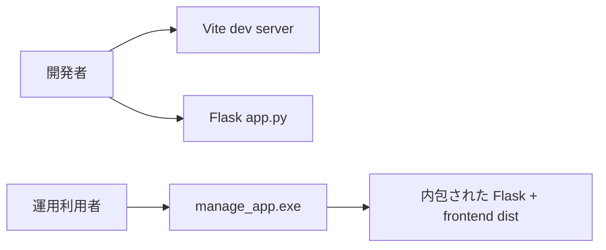

# System Overview

## 1. 目的

`Resource Manager` は、テーマ進行とメンバー負荷を月単位で管理し、計画・運用・振り返りをひとつのローカルアプリで完結させるためのソフトウェアです。

## 2. 想定ユースケース

| ユースケース | 説明 | 主画面 |
|---|---|---|
| 月次配員計画 | 各テーマに誰をどの月に何 % 配置するか決める | Gantt |
| 過負荷検知 | 特定メンバーの容量超過を確認する | Member Load / Insights |
| 健全性レビュー | データの不整合や将来不足を洗い出す | Insights |
| 状態保存 | ある時点の見え方を再現したい | Saved Views / Snapshots |
| 外部共有 | Excel や CSV に出したい | Export |
| 復元 | JSON バックアップから全体を戻す | Import |

## 3. 実行方式

## 4. 画面の責務分担

| 画面 | 説明 | 実装中心 |
|---|---|---|
| Gantt | 編集中心。テーマ単位で全体を操作する | `frontend/js/gantt/gantt-renderer.js` |
| Member Load | 閲覧中心。メンバー単位で過負荷を見る | `frontend/js/member/member-view.js` |
| Insights | 分析中心。問題発見と打ち手候補を見る | `frontend/js/insights-view.js` |
| Themes | マスタ管理 | `frontend/js/app.js` |
| Members | マスタ管理 | `frontend/js/app.js` |

## 5. 新人向け理解ポイント

1. まず `Theme`, `Member`, `Allocation` の 3 つを理解する。  
2. 次に `Gantt` がその 3 つをどう編集するかを見る。  
3. `Member Load` は `Allocation` をメンバー軸に見直した画面だと理解する。  
4. `Insights` は `Allocation` と `capacity` を集計して問題を作る画面だと理解する。  
5. `SavedView`, `Snapshot`, `Export/Import` は補助機能だが、運用上は重要。  
