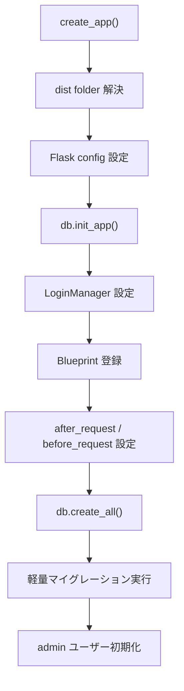
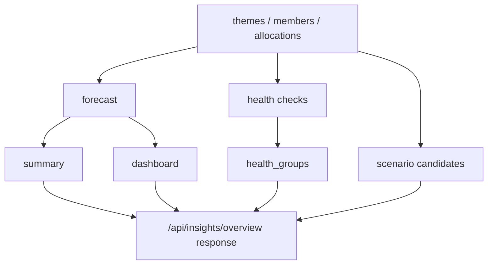

# Backend Design

## 1. 概要

バックエンドは Flask ベースのローカル API サーバです。  
責務は以下の 4 つに分かれます。

| 層 | 主ファイル | 役割 |
|---|---|---|
| 初期化 | `backend/app.py` | Flask アプリ生成、Blueprint 登録、DB 初期化 |
| モデル | `backend/models.py` | 永続化対象の定義 |
| ルート | `backend/routes/*.py` | HTTP API |
| サービス | `backend/services/allocation_service.py` | 再利用される集計ロジック |

## 2. アプリ起動

### 2.1 `backend/app.py` の責務

| 項目 | 内容 |
|---|---|
| `create_app()` | Flask アプリ生成の中心 |
| static 配信 | `frontend/dist` または EXE 内包 `dist` の配信 |
| DB 初期化 | `db.create_all()` と軽量マイグレーション |
| 認証初期化 | `LoginManager` の設定 |
| 起動時補助 | frozen 実行時のブラウザ自動起動 |

### 2.2 起動フロー

## 3. モデル設計

### 3.1 モデル一覧

| モデル | 用途 |
|---|---|
| `User` | ログインアカウント |
| `Theme` | 計画対象テーマ |
| `ThemeMilestone` | テーマに紐づくマイルストーン |
| `Member` | メンバー情報 |
| `Allocation` | 月次配員 |
| `Snapshot` | Gantt スナップショット |
| `SavedView` | 表示状態保存 |

### 3.2 設計上の注意点

| 項目 | 説明 |
|---|---|
| `theme_members` | `Theme` と `Member` の多対多中間テーブル |
| `Allocation` | `theme_id + member_id + month` の UNIQUE 制約を持つ |
| `ThemeMilestone` | `Theme` の一対多。表示順は `position` |
| `SavedView.state` | JSON 文字列として保存される |

## 4. ルート設計

### 4.1 認証

| ファイル | 主要 API | 説明 |
|---|---|---|
| `auth.py` | `/login`, `/logout`, `/me`, `/users` | セッションベース認証と管理者向けユーザー管理 |

### 4.2 テーマ・メンバー

| ファイル | 役割 | 備考 |
|---|---|---|
| `themes.py` | テーマ CRUD、担当割当（一括含む）、マイルストーン更新、dev_rank 管理 | 旧 `milestone_month` と新 `milestones[]` を橋渡し。`dev_complete_months` は JSON 形式で管理 |
| `members.py` | メンバー CRUD | `active=true/false` フィルタあり |

### 4.3 配員

| ファイル | 役割 | 備考 |
|---|---|---|
| `allocations.py` | 一覧、単一更新、複数更新、負荷集計 | SQLite UPSERT を利用 |

### 4.4 分析・補助

| ファイル | 役割 |
|---|---|
| `insights.py` | ダッシュボード、将来予測、シナリオシミュレーション |
| `snapshots.py` | スナップショット保存と比較元取得 |
| `saved_views.py` | 表示条件保存 |
| `export.py` | CSV / XLSX / JSON 出力 |
| `import_data.py` | JSON 復元 |

## 5. 集計サービス

`backend/services/allocation_service.py` は、複数ルートから再利用される基本集計を提供します。

| 関数 | 返すもの |
|---|---|
| `get_theme_loads()` | テーマ別・月別総配員率 |
| `get_member_loads()` | メンバー別・月別総配員率 |
| `get_warnings()` | 容量超過メンバーの警告一覧 |

## 6. インサイト設計

`backend/routes/insights.py` は独立した分析エンジンとして振る舞います。

### 6.1 主な内部ステップ

| ステップ | 関数 |
|---|---|
| データ収集 | `_collect_context()` |
| 予測用集計 | `_build_forecast()` |
| 内部指標算出 | `_build_health_checks()` |
| 指標グルーピング | `_group_health_checks()` |
| サマリ生成 | `_build_gap_summary()` |
| 部署分析 | `_build_department_load()` |
| 影響テーマ分析 | `_build_impact_themes()` |
| シナリオ候補生成 | `_build_recommendations()` |

### 6.2 出力イメージ

## 7. データ入出力

### 7.1 Export

| 形式 | 実装 | 特徴 |
|---|---|---|
| CSV | `export.py` | フロント生成コンテンツをそのまま配布 |
| XLSX | `export.py` + `openpyxl` | レート値に応じたセル色付けあり |
| JSON | `export.py` | フルバックアップ |

### 7.2 Import

`import_data.py` は JSON バックアップをトランザクション内で全復元します。

1. 既存の関連データ削除（`Allocation`、`ThemeMilestone`、テーマ・メンバー紐付け、`Theme`、`Member`。`User`・`Snapshot`・`SavedView` は削除対象外）  
2. `Member` 復元  
3. `Theme` 復元（`dev_rank`, `dev_complete_months` を含む）  
4. `ThemeMilestone` 復元（`is_completed` を含む）  
5. テーマ-メンバー紐付け復元  
6. `Allocation` 復元  
