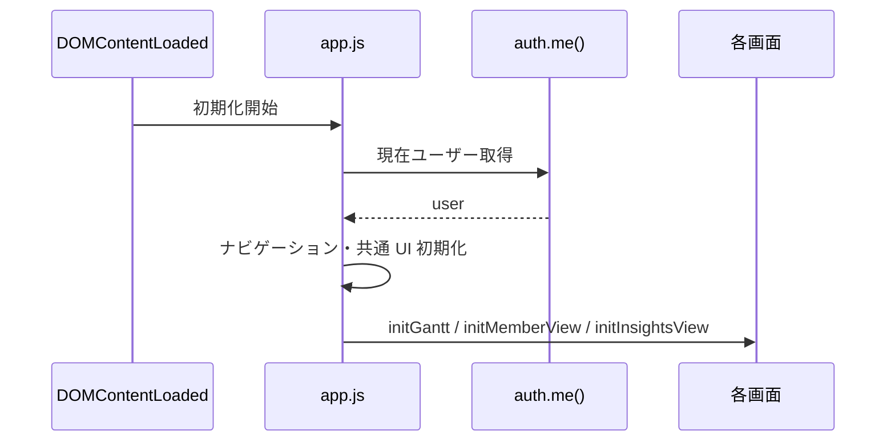

# Frontend Design

## 1. 概要

フロントエンドは `frontend/index.html` を入口にした単一ページアプリです。  
状態管理は軽量で、複雑なフレームワークは使わず、画面ごとの責務分割で保守しています。

## 2. 構成

| ファイル | 役割 |
|---|---|
| `frontend/index.html` | 画面骨格と DOM アンカー |
| `frontend/js/app.js` | 初期化ハブ、画面切替、各画面の結線 |
| `frontend/js/api.js` | API クライアント |
| `frontend/js/shared-state.js` | 共有表示条件 |
| `frontend/js/ui.js` | toast / dialog / busy state |
| `frontend/js/gantt/*` | Gantt 関連機能 |
| `frontend/js/member/member-view.js` | メンバー負荷画面 |
| `frontend/js/insights-view.js` | Insights 画面 |

## 3. 初期化フロー

## 4. 共有状態設計

### 4.1 `shared-state.js`

| 状態 | 内容 |
|---|---|
| `preset` | 表示期間プリセット |
| `startMonth` | 表示開始月 |
| `scale` | 1/3/6/12 か月スケール |
| `ganttSearch` | Gantt 検索条件 |
| `ganttCategory` | カテゴリフィルタ |
| `ganttOwner` | 担当者フィルタ |
| `ganttStatus` | ステータスフィルタ |
| `ganttPriority` | 優先度フィルタ |
| `memberSearch` | メンバー検索 |
| `groupBy` | Gantt のグループ単位 |

### 4.2 方式

| 仕組み | 使い方 |
|---|---|
| `localStorage` | 永続化 |
| `CustomEvent` | 画面横断通知 |
| `subscribeViewState()` | 各画面で購読 |

## 5. Gantt 画面

### 5.1 主責務

| 機能 | 説明 |
|---|---|
| 描画 | テーマ・メンバー・月のマトリクス表示 |
| 編集 | セル単位編集、複数セル貼り付け |
| 操作 | キーボード移動、DnD、折りたたみ、ズーム |
| 補助 | スナップショット、保存ビュー、CSV/XLSX 出力 |

### 5.2 関係ファイル

| ファイル | 役割 |
|---|---|
| `gantt-renderer.js` | 画面本体 |
| `gantt-editor.js` | セルエディタ |
| `gantt-dnd.js` | ドラッグ&ドロップ |
| `date-utils.js` | 月計算 |

### 5.3 代表的な処理

| 処理 | 関数例 |
|---|---|
| 初期化 | `initGantt()` |
| 再描画 | `refreshGantt()` |
| 制御群バインド | `bindControls()` |
| 編集保存 | `saveSelectedCell()` |
| DnD 移動 | `performDragAndDropMove()` |
| CSV 出力 | `exportCsv()` |
| XLSX 用データ組み立て | `getGanttExportDataset()`, `getGanttGridExportDataset()` |

## 6. Member Load 画面

### 6.1 見方

`Member Load` は Gantt の逆軸ビューです。  
テーマ中心ではなく、メンバー中心で「月ごとにどれだけ埋まっているか」を表示します。

### 6.2 主な責務

| 機能 | 説明 |
|---|---|
| メンバー別集約 | 月ごとの総配員率表示 |
| テーマ内訳展開 | メンバー行を展開してテーマ別配員を確認 |
| 過負荷強調 | capacity 超過の視覚化 |
| 詳細ポップアップ | セルホバーで構成テーマを表示 |
| CSV 出力 | メンバー軸の表形式出力 |

## 7. Insights 画面

### 7.1 役割

Insights 画面は「編集」ではなく「発見」に特化しています。

| 出力 | 説明 |
|---|---|
| Summary | 全体不足、余力、ボトルネック数 |
| Health Checks | データ品質・運用上の問題・将来リスク |
| Recommendations | 余力メンバーへの移管候補 |
| Dashboard | 月次推移、部署負荷、影響テーマ、Project Load Ribbon |

### 7.2 ドリルダウン

Insights の各カードは Gantt / Member Load に検索条件つきで遷移できます。

## 8. 共通 UI

### 8.1 `ui.js`

| 機能 | 説明 |
|---|---|
| `showToast()` | 通知表示 |
| `showConfirmDialog()` | 確認ダイアログ |
| `showPromptDialog()` | 入力ダイアログ |
| `setSaveState()` | 保存状態ピル更新 |
| `setBusyState()` | 処理中表示 |

## 9. HTML レイアウト

`frontend/index.html` は、以下の DOM セクションを事前に持っています。

| 領域 | 用途 |
|---|---|
| `#sidebar` | ナビゲーションと共通操作 |
| `#view-gantt` | Gantt 画面 |
| `#view-member-load` | Member Load 画面 |
| `#view-insights` | Insights 画面 |
| `#view-themes` | テーマ一覧 |
| `#view-members` | メンバー一覧 |
| `#modal-overlay` | 汎用モーダル |
| `#dialog-overlay` | confirm / prompt |
| `#cell-editor` | セル編集用浮動 UI |
